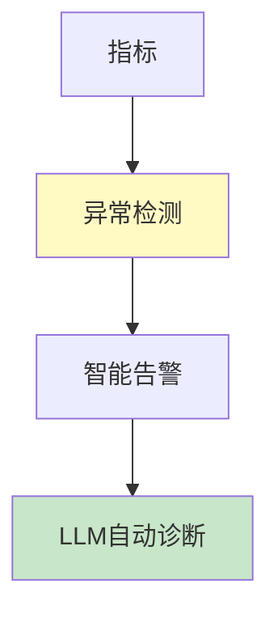

# 可观测性进阶图解

> 用图解理解智能告警和自动诊断。

---

```mermaid
graph TB
    METRICS["指标"] --> DETECT["异常检测"]
    DETECT --> ALERT["智能告警"]
    ALERT --> DIAGNOSE["LLM自动诊断"]

    style DETECT fill:#FFF9C4
    style DIAGNOSE fill:#C8E6C9
```

---

## 检查清单

| 检查项 | 状态 |
|--------|------|
| 有智能告警引擎 | ☐ |
