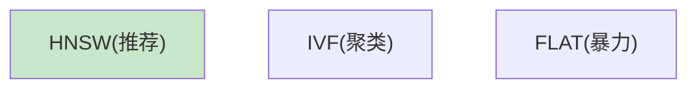

# 向量索引图解

> 用图解理解索引类型和 HNSW 参数。

---

```mermaid
graph TB
    H1["HNSW(推荐)"]
    H2["IVF(聚类)"]
    H3["FLAT(暴力)"]

    style H1 fill:#C8E6C9
```

---

## 检查清单

| 检查项 | 状态 |
|--------|------|
| 有HNSW参数指南 | ☐ |
