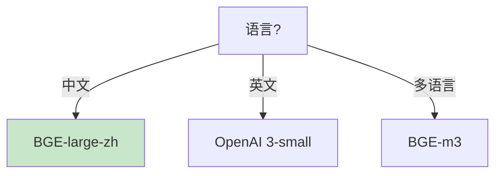

# Embedding 模型图解

> 用图解理解模型对比和选型。

---

```mermaid
graph TB
    Q["语言?"] -->|中文| BGE["BGE-large-zh"]
    Q -->|英文| OPENAI["OpenAI 3-small"]
    Q -->|多语言| M3["BGE-m3"]

    style BGE fill:#C8E6C9
```

---

## 检查清单

| 检查项 | 状态 |
|--------|------|
| 有模型对比 | ☐ |
| 有选型 | ☐ |
