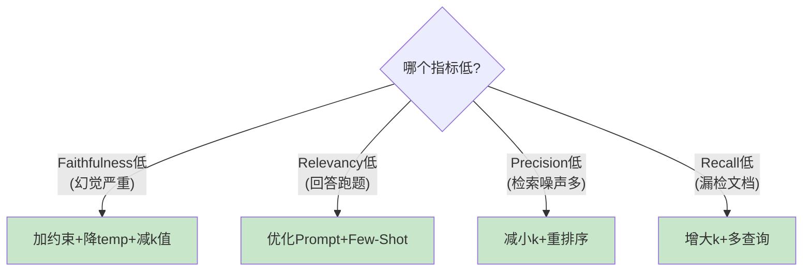

# RAG 评估指标图解

> 用图解理解 RAG 三层评估框架和各指标的含义。

---

## 一、三层评估框架

```mermaid
graph TB
    subgraph 三层评估 {"RAG 三层评估"}
        L1["Layer 1: 检索质量<br/>检索到正确的文档了吗？<br/>Precision / Recall"]
        L2["Layer 2: 生成质量<br/>回答忠实于上下文吗？<br/>Faithfulness / Relevancy"]
        L3["Layer 3: 端到端<br/>用户最终体验如何？<br/>Correctness / Latency"]
    end

    L1 --> L2 --> L3

    style L1 fill:#E3F2FD
    style L2 fill:#FFF9C4
    style L3 fill:#C8E6C9
```

## 二、检索质量指标

```mermaid
graph TB
    subgraph 精确率 {"Context Precision（精确率）"}
        Q["查询"] --> RET["检索到5个文档"]
        RET --> REL["3个相关 ✅"]
        RET --> IRR["2个不相关 ❌"]
        REL --> PREC["精确率 = 3/5 = 60%"]
    end

    style REL fill:#C8E6C9
    style IRR fill:#FFCDD2
```

```mermaid
graph TB
    subgraph 召回率 {"Context Recall（召回率）"}
        ALL["全部相关文档: 4个"]
        RET2["检索到: 3个相关"]
        MISS["漏检: 1个 ❌"]
        ALL --> RET2 & MISS
        RET2 --> REC["召回率 = 3/4 = 75%"]
    end

    style RET2 fill:#C8E6C9
    style MISS fill:#FFCDD2
```

## 三、生成质量指标

```mermaid
graph LR
    subgraph 忠实度 {"Faithfulness（忠实度）"}
        CTX["上下文: 'LangChain是2022年创建的'"]
        ANS1["回答: 'LangChain是2022年创建的' ✅ 有据"]
        ANS2["回答: 'LangChain由Google创建' ❌ 幻觉"]
        CTX --> ANS1
        CTX -.-> ANS2
    end

    style ANS1 fill:#C8E6C9
    style ANS2 fill:#FFCDD2
```

```mermaid
graph LR
    subgraph 相关性 {"Answer Relevancy（相关性）"}
        Q2["问题: '什么是RAG？'"]
        GOOD["回答: 'RAG是检索增强生成...' ✅ 切题"]
        BAD["回答: 'RAG是一种布料' ❌ 跑题"]
        Q2 --> GOOD
        Q2 -.-> BAD
    end

    style GOOD fill:#C8E6C9
    style BAD fill:#FFCDD2
```

## 四、指标到改进的映射



## 五、目标基准

| 指标 | 目标 | 告警 |
|------|------|------|
| Faithfulness | ≥0.90 | <0.85 |
| Relevancy | ≥0.85 | <0.70 |
| Precision | ≥0.80 | <0.60 |
| Recall | ≥0.90 | <0.80 |
