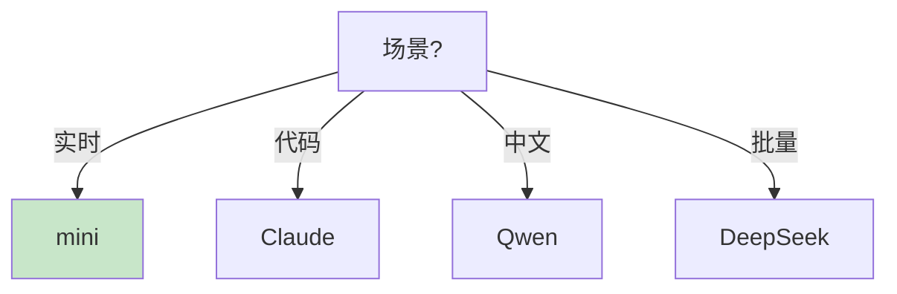

# 模型选型图解

> 用图解理解场景化选型和混合策略。

---

```mermaid
graph TB
    Q["场景?"] -->|实时| MINI["mini"]
    Q -->|代码| CLAUDE["Claude"]
    Q -->|中文| QWEN["Qwen"]
    Q -->|批量| DS["DeepSeek"]

    style MINI fill:#C8E6C9
```

---

## 检查清单

| 检查项 | 状态 |
|--------|------|
| 有场景选型 | ☐ |
