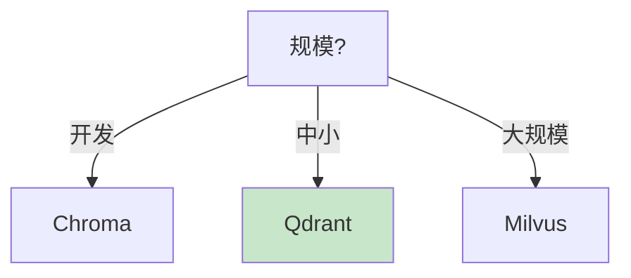

# 向量数据库图解

> 用图解理解 6 大对比和选型。

---

```mermaid
graph TB
    Q["规模?"] -->|开发| CHROMA["Chroma"]
    Q -->|中小| QDRANT["Qdrant"]
    Q -->|大规模| MILVUS["Milvus"]

    style QDRANT fill:#C8E6C9
```

---

## 检查清单

| 检查项 | 状态 |
|--------|------|
| 有6大对比 | ☐ |
