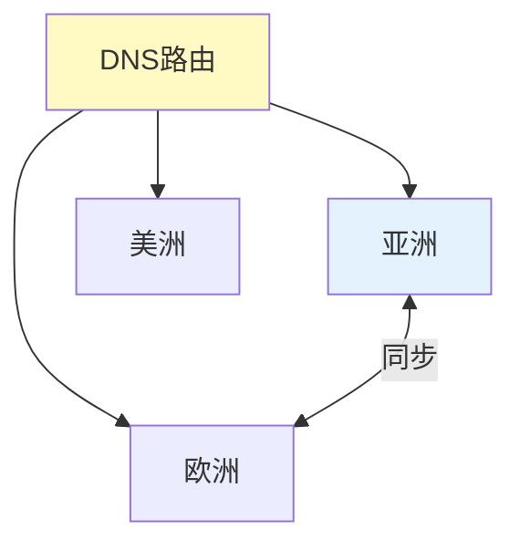

# 多区域部署图解

> 用图解理解区域路由和数据同步。

---

```mermaid
graph TB
    DNS["DNS路由"] --> R1["亚洲"]
    DNS --> R2["欧洲"]
    DNS --> R3["美洲"]
    R1 <-->|"同步"| R2

    style DNS fill:#FFF9C4
    style R1 fill:#E3F2FD
```

---

## 检查清单

| 检查项 | 状态 |
|--------|------|
| 有区域路由器 | ☐ |
| 有跨区域同步 | ☐ |
