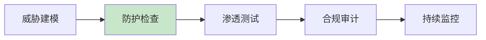

# 安全审计框架图解

> 用图解理解5步审计流程。

---

```mermaid
graph LR
    T["威胁建模"] --> D["防护检查"]
    D --> P["渗透测试"]
    P --> C["合规审计"]
    C --> M["持续监控"]

    style D fill:#C8E6C9
```

---

## 检查清单

| 检查项 | 状态 |
|--------|------|
| 有审计检查表 | ☐ |
| 有合规评分 | ☐ |
