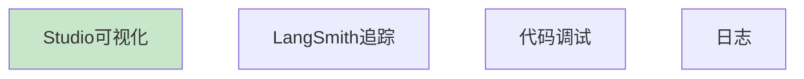

# 调试可视化图解

> 用图解理解调试工具全景。

---

```mermaid
graph TB
    T1["Studio可视化"]
    T2["LangSmith追踪"]
    T3["代码调试"]
    T4["日志"]

    style T1 fill:#C8E6C9
```

---

## 检查清单

| 检查项 | 状态 |
|--------|------|
| 能用Studio | ☐ |
| 能查状态 | ☐ |
