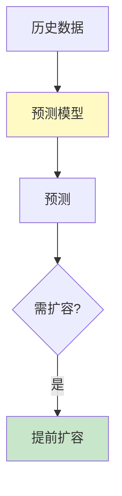

# 容量预测图解

> 用图解理解预测流程。

---

```mermaid
graph TB
    HIST["历史数据"] --> MODEL["预测模型"]
    MODEL --> FORECAST["预测"]
    FORECAST --> ALERT{"需扩容?"}
    ALERT -->|是| SCALE["提前扩容"]

    style MODEL fill:#FFF9C4
    style SCALE fill:#C8E6C9
```

---

## 检查清单

| 检查项 | 状态 |
|--------|------|
| 有预测器 | ☐ |
