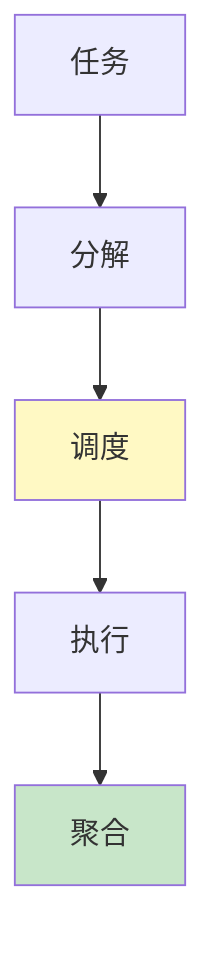

# 编排引擎图解

> 用图解理解编排流程和拓扑排序。

---

```mermaid
graph TB
    INPUT["任务"] --> DECOMPOSE["分解"]
    DECOMPOSE --> SCHEDULE["调度"]
    SCHEDULE --> EXEC["执行"]
    EXEC --> AGGREGATE["聚合"]

    style SCHEDULE fill:#FFF9C4
    style AGGREGATE fill:#C8E6C9
```

---

## 检查清单

| 检查项 | 状态 |
|--------|------|
| 有编排引擎 | ☐ |
| 有拓扑排序 | ☐ |
