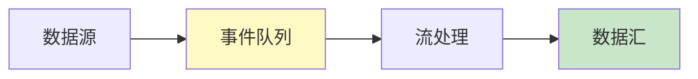

# 数据管道图解

> 用图解理解事件流处理。

---

```mermaid
graph LR
    SRC["数据源"] --> QUEUE["事件队列"]
    QUEUE --> PROC["流处理"]
    PROC --> SINK["数据汇"]

    style QUEUE fill:#FFF9C4
    style SINK fill:#C8E6C9
```

---

## 检查清单

| 检查项 | 状态 |
|--------|------|
| 有数据管道 | ☐ |
