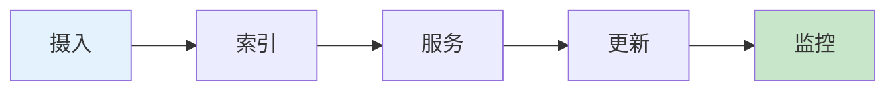

# 知识库管理图解

> 用图解理解全生命周期管理。

---

```mermaid
graph LR
    INGEST["摄入"] --> INDEX["索引"]
    INDEX --> SERVE["服务"]
    SERVE --> UPDATE["更新"]
    UPDATE --> MONITOR["监控"]

    style INGEST fill:#E3F2FD
    style MONITOR fill:#C8E6C9
```

---

## 检查清单

| 检查项 | 状态 |
|--------|------|
| 有知识库管理器 | ☐ |
