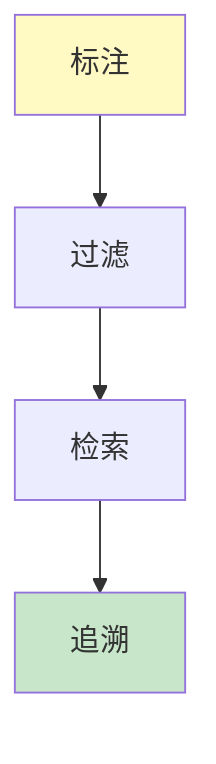

# 元数据管理图解

> 用图解理解标注、过滤和追溯。

---

```mermaid
graph TB
    TAG["标注"] --> FILTER["过滤"]
    FILTER --> SEARCH["检索"]
    SEARCH --> TRACE["追溯"]

    style TAG fill:#FFF9C4
    style TRACE fill:#C8E6C9
```

---

## 检查清单

| 检查项 | 状态 |
|--------|------|
| 有元数据Schema | ☐ |
