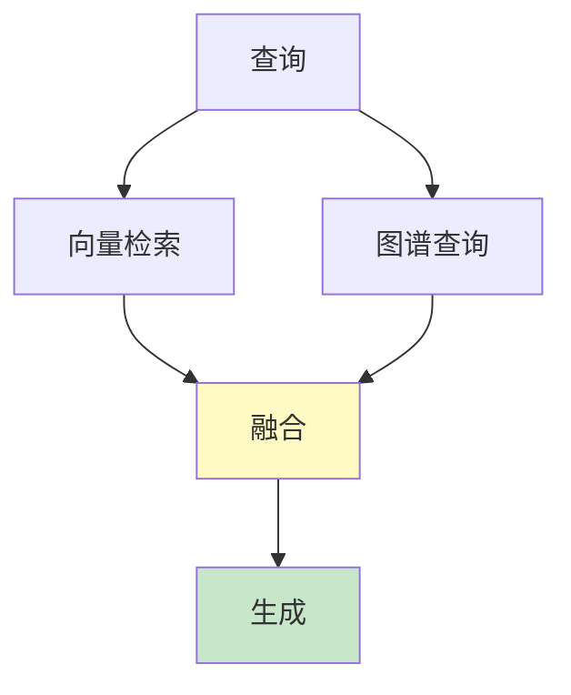

# 知识图谱融合图解

> 用图解理解混合检索和冲突解决。

---

```mermaid
graph TB
    Q["查询"] --> VEC["向量检索"]
    Q --> GRAPH["图谱查询"]
    VEC --> FUSE["融合"]
    GRAPH --> FUSE
    FUSE --> GEN["生成"]

    style FUSE fill:#FFF9C4
    style GEN fill:#C8E6C9
```

---

## 检查清单

| 检查项 | 状态 |
|--------|------|
| 有融合检索器 | ☐ |
