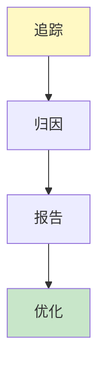

# 成本归因图解

> 用图解理解成本追踪和归因分析。

---

```mermaid
graph TB
    TRACK["追踪"] --> ATTR["归因"]
    ATTR --> REPORT["报告"]
    REPORT --> OPT["优化"]

    style TRACK fill:#FFF9C4
    style OPT fill:#C8E6C9
```

---

## 检查清单

| 检查项 | 状态 |
|--------|------|
| 有成本追踪 | ☐ |
| 有优化建议 | ☐ |
