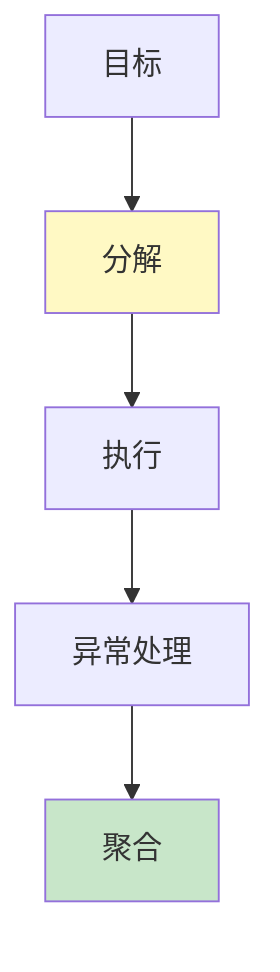

# 工作流编排图解

> 用图解理解编排整合。

---

```mermaid
graph TB
    GOAL["目标"] --> DECOMP["分解"]
    DECOMP --> EXEC["执行"]
    EXEC --> HANDLE["异常处理"]
    HANDLE --> RESULT["聚合"]

    style DECOMP fill:#FFF9C4
    style RESULT fill:#C8E6C9
```

---

## 检查清单

| 检查项 | 状态 |
|--------|------|
| 有编排器 | ☐ |
| 有异常处理 | ☐ |
