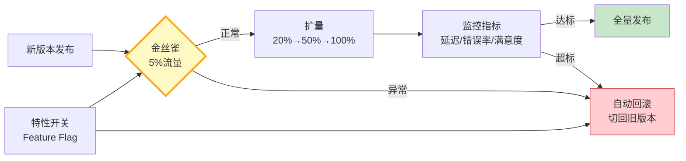

# 灰度发布图解

> 金丝雀发布 + 特性开关 + 自动回滚，保障 LLM 应用平滑上线。

---

---

## 灰度发布阶段

| 阶段 | 流量比例 | 持续时间 | 核心监控指标 | 回滚阈值 |
|------|----------|----------|-------------|----------|
| 金丝雀 | 5% | 30min | 错误率、p99延迟 | 错误率>2% |
| 扩量一 | 20% | 1h | 用户满意度、Token成本 | 满意度↓10% |
| 扩量二 | 50% | 2h | 转化率、投诉量 | 转化率↓5% |
| 全量 | 100% | 持续 | 全指标基线对比 | 任一SLO违约 |

---

## 检查清单

| 检查项 | 状态 |
|--------|------|
| 有特性开关 | ☐ |
| 金丝雀最小流量验证 | ☐ |
| 有自动回滚机制 | ☐ |
| 监控指标覆盖延迟/错误/满意度 | ☐ |
