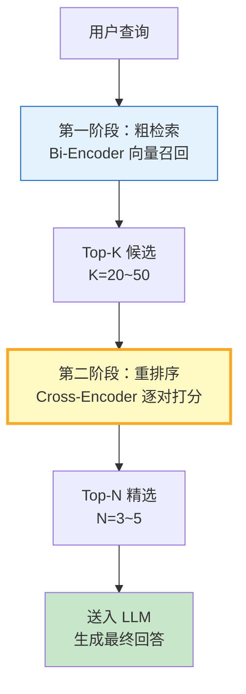

# RAG 重排序图解

> 两阶段检索：先粗筛召回 Top-K，再用 Cross-Encoder 精排 Top-N，兼顾速度与精度。

---

---

## Bi-Encoder vs Cross-Encoder

| 维度 | Bi-Encoder | Cross-Encoder |
|------|-----------|---------------|
| 交互方式 | 独立编码后计算相似度 | Query-Doc 拼接后联合编码 |
| 速度 | 快（可预计算向量） | 慢（逐对推理） |
| 精度 | 中等 | 高 |
| 适用阶段 | 第一阶段粗检索 | 第二阶段精排 |
| 典型模型 | BGE / GTE / OpenAI Embedding | BGE-Reranker / Cohere Rerank |

---

## 检查清单

| 检查项 | 状态 |
|--------|------|
| 两阶段检索架构 | ☐ |
| Bi-Encoder 粗筛 | ☐ |
| Cross-Encoder 精排 | ☐ |
| Top-K → Top-N 裁剪 | ☐ |
