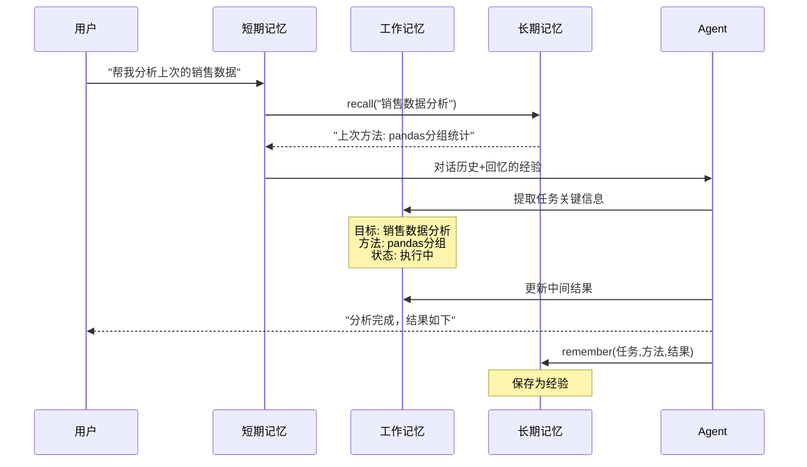
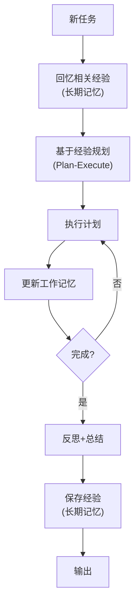

# Agent 记忆与规划图解

> 用图解理解 Agent 的三层记忆模型和三种规划模式。

---

## 一、三层记忆模型

```mermaid
graph TB
    subgraph 记忆层次 {"Agent 三层记忆"}
        L1["Layer 1: 短期记忆<br/>当前对话上下文<br/>实现: messages列表(Annotated list, add)<br/>生命周期: 单次会话"]
        L2["Layer 2: 工作记忆<br/>任务关键信息<br/>实现: State中的extracted_entities等<br/>生命周期: 单次任务"]
        L3["Layer 3: 长期记忆<br/>跨会话经验<br/>实现: 向量库/知识图谱<br/>生命周期: 永久"]
    end

    L1 --> L2 --> L3

    style L1 fill:'#C8E6C9'
    style L2 fill:'#FFF9C4'
    style L3 fill:'#F3E5F5'
```

## 二、记忆在任务中的流转



## 三、三种规划模式

```mermaid
graph TB
    subgraph ReAct {"ReAct（无规划）"}
        R1["即时决策<br/>思考→行动→观察→循环<br/>✅ 简单<br/>❌ 可能走弯路"]
    end

    subgraph PlanExecute {"Plan-Execute（静态规划）"}
        P1["先规划全部步骤"]
        P1 --> P2["逐步执行"]
        P2 --> P3["✅ 有计划性<br/>❌ 计划可能不适用"]
    end

    subgraph RePlan {"Re-Plan（动态规划）"}
        E1["制定初始计划"]
        E1 --> E2["执行一步"]
        E2 --> E3{"评估结果"}
        E3 -->|"符合预期"| E4["继续下一步"]
        E3 -->|"不符合"| E5["重新规划"]
        E5 --> E2
        E4 --> E6{"还有步骤?"}
        E6 -->|"是"| E2
        E6 -->|"否"| E7["完成 ✅"]
    end

    style ReAct fill:'#C8E6C9'
    style PlanExecute fill:'#FFF9C4'
    style RePlan fill:'#FFE0B2'
```

## 四、反思模式

```mermaid
graph TB
    subgraph Reflection {"Reflection 反思循环"}
        GEN["生成"] --> EVAL["自我评价"]
        EVAL --> SCORE{"评分≥4?"}
        SCORE -->|"否"| REFLECT["反思<br/>哪里不好？"]
        REFLECT --> IMPROVE["改进回答"]
        IMPROVE --> EVAL
        SCORE -->|"是"| OUT["输出 ✅"]
        SCORE -->|"重试≥3次"| OUT
    end

    style GEN fill:'#E3F2FD'
    style EVAL fill:'#FFF9C4'
    style REFLECT fill:'#FFE0B2'
    style OUT fill:'#C8E6C9'
```

## 五、记忆+规划协同



## 六、选型决策

| 场景 | 记忆 | 规划 |
|------|------|------|
| 简单工具调用 | 短期 | ReAct |
| 多步任务 | 短期+工作 | Plan-Execute |
| 复杂探索 | 短期+工作+长期 | Re-Plan |
| 高质量输出 | 短期 | Reflection |
| 跨会话学习 | 长期 | 基于经验规划 |
