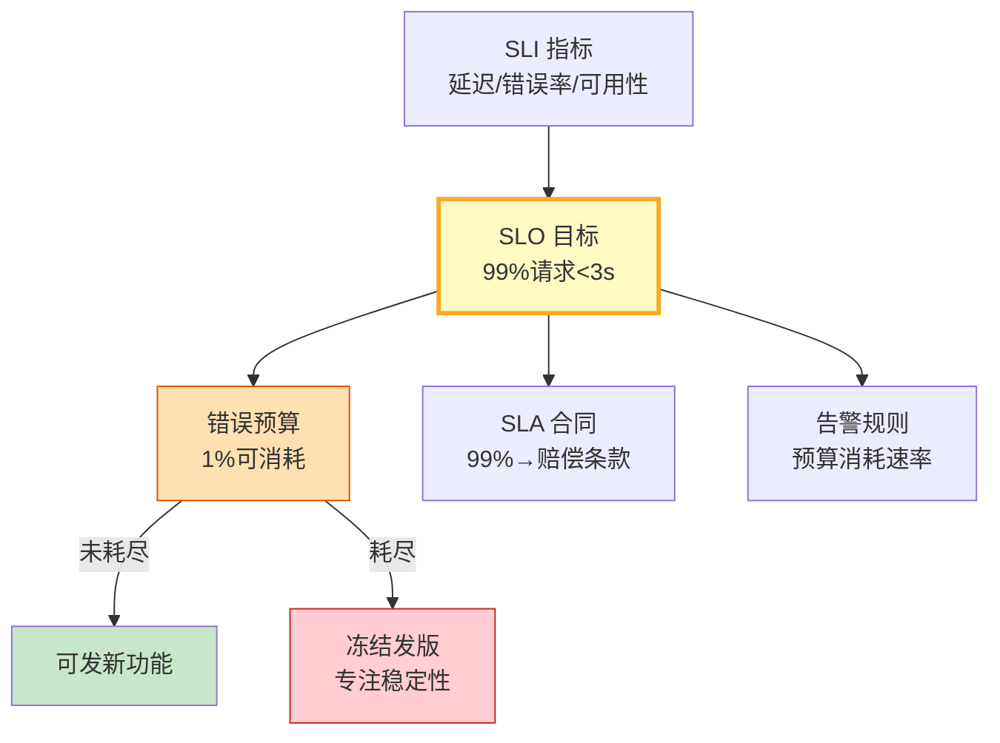

# LLM 应用 SLO 速查图解

> SLI → SLO → SLA + 错误预算 + 告警规则，用一图掌握 LLM 应用可靠性体系。

---

---

## LLM 应用核心 SLO

| SLO 指标 | 目标值 | 告警阈值 | 测量窗口 |
|----------|--------|----------|----------|
| 首Token延迟 | p99 < 2s | p99 > 3s 持续5min | 5min 滚动 |
| 完整响应延迟 | p99 < 8s | p99 > 12s 持续5min | 5min 滚动 |
| 错误率 | < 1% | > 2% 持续3min | 1min 滚动 |
| 可用性 | > 99.5% | < 99% 持续10min | 30天 |
| 幻觉率 | < 5% | > 8% 持续1h | 1h 抽样 |

---

## 检查清单

| 检查项 | 状态 |
|--------|------|
| 定义核心 SLI 指标 | ☐ |
| 设定 SLO 目标值 | ☐ |
| 计算错误预算 | ☐ |
| 有预算耗尽告警 | ☐ |
