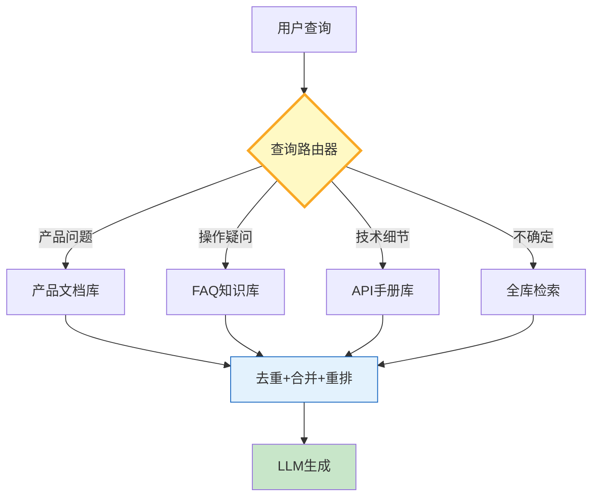

# RAG 查询路由图解

> 先判断意图再选知识库——精准命中、降低延迟、节省 Token。

---

---

## 路由策略对比

| 策略 | 速度 | 灵活度 | 适用 |
|------|------|--------|------|
| LLM分类路由 | 中 | 高 | 知识源>3 |
| 关键词规则 | 快 | 低 | 知识源<3 |
| 嵌入相似度 | 快 | 中 | 大规模 |
| 混合路由 | 中 | 高 | 生产环境 |

---

## 检查清单

| 检查项 | 状态 |
|--------|------|
| 有查询路由器 | ☐ |
| 支持多知识源 | ☐ |
| 有全库兜底 | ☐ |
| 有结果去重 | ☐ |
