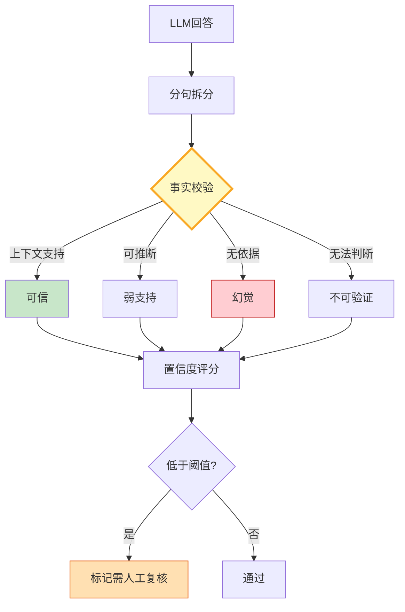

# 幻觉检测图解

> 分句拆分 → 逐句校验 → 置信度评分——让幻觉无所遁形。

---

---

## 幻觉类型

| 类型 | 定义 | 检测难度 |
|------|------|----------|
| 上下文矛盾 | 与文档矛盾 | 中 |
| 上下文虚构 | 编造不存在信息 | 高 |
| 逻辑跳跃 | 推理链断裂 | 高 |

---

## 检查清单

| 检查项 | 状态 |
|--------|------|
| 有断言拆分 | ☐ |
| 有逐句校验 | ☐ |
| 有置信度评分 | ☐ |
| 有低置信度标记 | ☐ |
