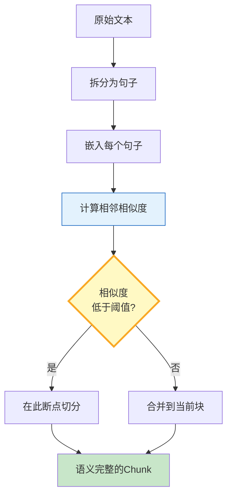

# 语义分块图解

> 不再"每500字符切一刀"——用嵌入相似度检测语义断点，让每个chunk语义完整。

---

---

## 分块策略对比

| 策略 | 语义质量 | 速度 | 适用 |
|------|----------|------|------|
| 固定大小 | 差 | 极快 | 原型 |
| 递归分块 | 中 | 快 | 通用 |
| 语义分块 | 高 | 中 | 高质量RAG |
| 自适应 | 高 | 中 | 生产环境 |

---

## 检查清单

| 检查项 | 状态 |
|--------|------|
| 有语义分块 | ☐ |
| 有递归分块 | ☐ |
| 有自适应选择 | ☐ |
| 有质量评估 | ☐ |
