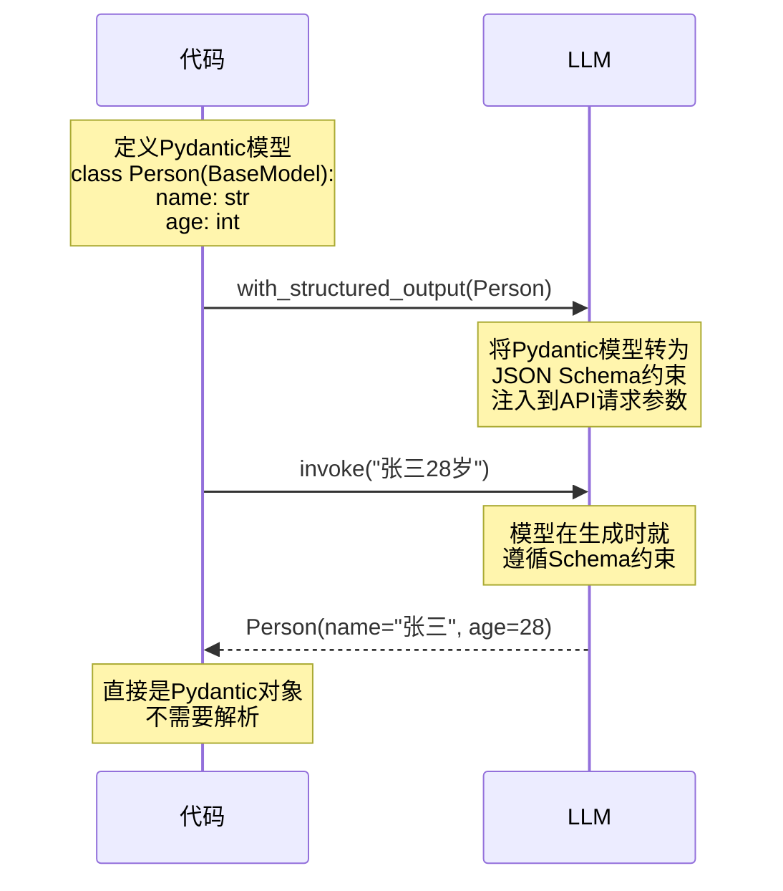
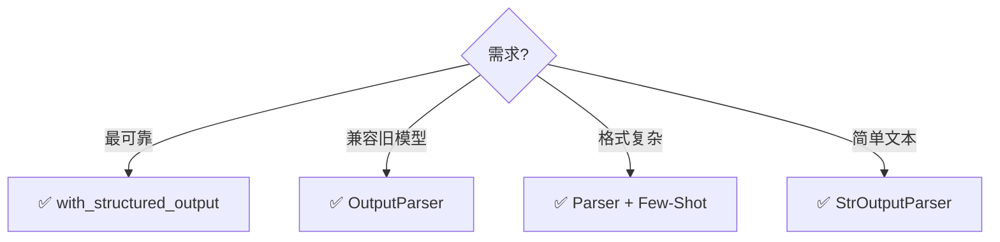

# 结构化输出图解

> 用图解理解让 LLM 输出可控结构化数据的四种方式。

---

## 一、四种方式对比

```mermaid
graph TB
    subgraph 四种方式 {"结构化输出四种方式（可靠性递增）"}
        M1["❶ 文字描述格式<br/>'请输出JSON'<br/>可靠性: ★★☆<br/>LLM可能不遵守"]
        M2["❷ OutputParser<br/>注入schema + 解析<br/>可靠性: ★★★<br/>附带格式说明"]
        M3["❸ Few-Shot<br/>展示格式示例<br/>可靠性: ★★★☆<br/>模式引导"]
        M4["❹ with_structured_output<br/>模型原生保证<br/>可靠性: ★★★★★<br/>最可靠"]
    end

    M1 --> M2 --> M3 --> M4

    style M1 fill:'#FFE0B2'
    style M4 fill:'#C8E6C9'
```

## 二、with_structured_output 原理



## 三、类型流转

```mermaid
graph LR
    subgraph 类型流转 {"结构化输出的类型流转"}
        I["输入: str<br/>'张三28岁'"] --> LLM["LLM"]
        LLM --> O1["→ Person对象<br/>(with_structured_output)"]
        LLM --> O2["→ dict<br/>(JsonOutputParser)"]
        LLM --> O3["→ str<br/>(StrOutputParser)"]

        O1 --> A1["✅ 类型安全<br/>✅ 属性访问"]
        O2 --> A2["⚠️ 字典访问<br/>⚠️ 需手动校验"]
        O3 --> A3["❌ 需自己解析"]
    end

    style O1 fill:'#C8E6C9'
    style O2 fill:'#FFF9C4'
    style O3 fill:'#FFCDD2'
```

## 四、Pydantic 模型定义

```mermaid
graph TB
    subgraph 模型结构 {"Pydantic 模型示例"}
        P["Person"]
        P --> F1["name: str<br/>Field(description='姓名')"]
        P --> F2["age: int<br/>Field(description='年龄')"]
        P --> F3["hobbies: list[str]<br/>Field(description='爱好')"]
        P --> F4["address: Address (嵌套)"]
        P --> F5["sentiment: Sentiment (枚举)"]

        F4 --> A["Address<br/>city: str<br/>street: str"]
        F5 --> S["Sentiment<br/>POSITIVE/NEGATIVE/NEUTRAL"]
    end

    style P fill:'#E3F2FD'
    style A fill:'#FFF9C4'
    style S fill:'#F3E5F5'
```

## 五、选择决策



## 六、常见输出模式

```mermaid
graph TB
    subgraph 模式 {"常见结构化输出模式"}
        S1["信息提取<br/>{name, age, hobbies}"]
        S2["分类<br/>{category, confidence}"]
        S3["评分<br/>{score, reason}"]
        S4["决策<br/>{action, params}"]
        S5["表格<br/>{headers, rows}"]
    end

    style S1 fill:'#E3F2FD'
    style S2 fill:'#FFF9C4'
    style S4 fill:'#FFE0B2'
```
