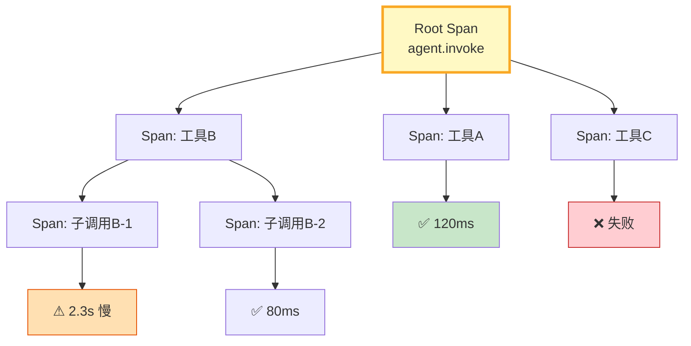

# 调用链追踪图解

> 一个Agent执行=一棵span树——根span记录总耗时，子span记录每个工具调用，慢节点和失败节点一目了然。

---

---

## span 字段速查

| 字段 | 说明 | 示例 |
|------|------|------|
| span_id | 唯一标识 | a1b2c3 |
| parent_id | 父span | f6e5d4 |
| duration_ms | 耗时 | 120.5 |
| status | ok/error/slow | slow |

---

## 检查清单

| 检查项 | 状态 |
|--------|------|
| 有span追踪器 | ☐ |
| 支持父子树 | ☐ |
| 有慢节点检测 | ☐ |
| 有异常事件 | ☐ |
