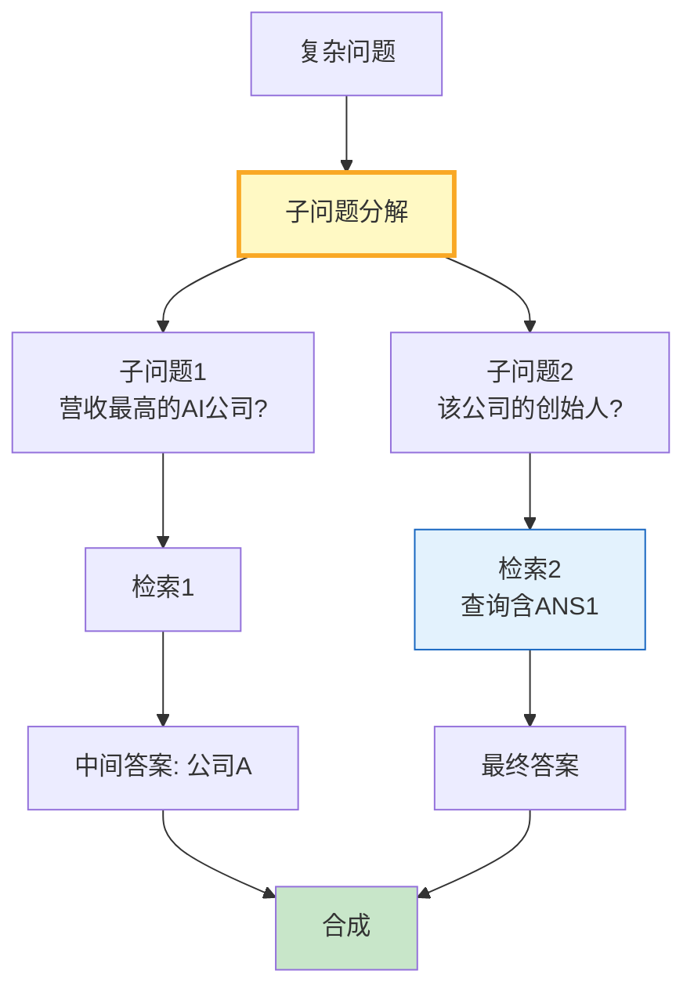

# 多跳问答图解

> 复杂问题分解为子问题→串行检索→中间答案作为下一个检索的上下文→合成最终答案。

---

---

## 多跳类型

| 类型 | 依赖 | 难度 |
|------|------|------|
| 链式 | 严格串行 | 中 |
| 桥接 | 需合并 | 中高 |
| 比较 | 可并行 | 中 |
| 推理跳跃 | 隐式 | 高 |

---

## 检查清单

| 检查项 | 状态 |
|--------|------|
| 有问题分解 | ☐ |
| 有依赖检索 | ☐ |
| 有合成步骤 | ☐ |
| 限制子问题数 | ☐ |
