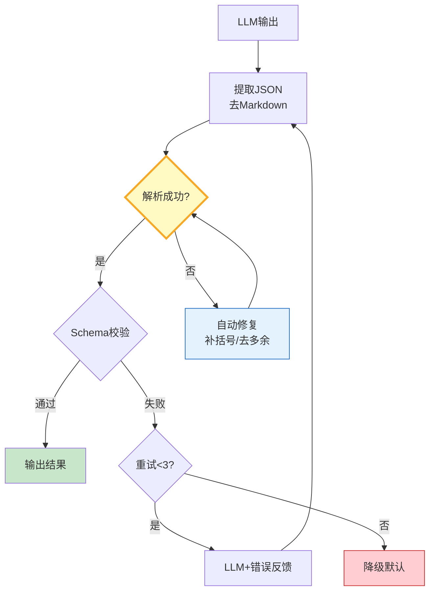

# 输出格式校验图解

> LLM输出→提取JSON→解析→Schema校验→失败自动修复重试→降级兜底。

---

---

## 约束方式对比

| 方式 | 可靠性 | 成本 | 适用 |
|------|--------|------|------|
| JSON Schema | 高 | 低 | 结构化 |
| Pydantic | 高 | 低 | Python |
| 提示工程 | 中 | 0 | 简单 |
| 多次采样 | 高 | 高 | 高可靠 |

---

## 检查清单

| 检查项 | 状态 |
|--------|------|
| 有JSON提取 | ☐ |
| 有自动修复 | ☐ |
| 有Schema校验 | ☐ |
| 有重试+反馈 | ☐ |
