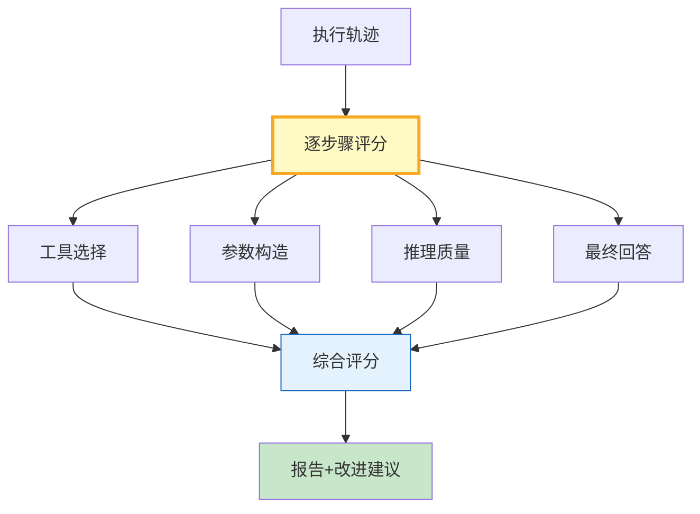

# 轨迹评分图解

> 把Agent一次执行拆成步骤→逐步骤打分→综合评分+优缺点+改进建议。

---

---

## 评分维度

| 维度 | 评分方式 | 价值 |
|------|----------|------|
| 工具选择 | 选对了吗 | 高 |
| 参数构造 | 合理吗 | 中高 |
| 推理质量 | 链合理吗 | 高 |
| 回答质量 | 准确有用吗 | 极高 |
| 轨迹效率 | 多余步骤? | 中 |

---

## 检查清单

| 检查项 | 状态 |
|--------|------|
| 有逐步骤评分 | ☐ |
| 有综合评分 | ☐ |
| 有优缺点 | ☐ |
| 有改进建议 | ☐ |
