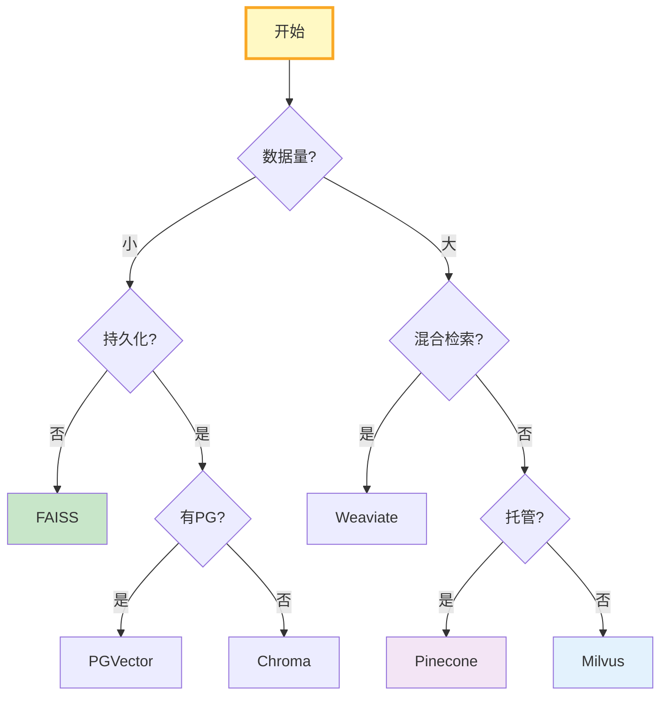

# 向量库选型图解

> 数据量→部署方式→功能需求→决策树一步选对向量库。

---

---

## 选型速查

| 向量库 | 规模 | 混合检索 | 适用 |
|-------|------|----------|------|
| FAISS | 1亿+ | ❌ | 纯内存超快 |
| Chroma | 100万 | ❌ | 原型开发 |
| PGVector | 1000万 | ✅ | 已有PG |
| Milvus | 10亿+ | ✅ | 大规模 |
| Pinecone | 10亿+ | ✅ | 零运维 |
| Weaviate | 1亿+ | ✅ | 混合检索 |

---

## 检查清单

| 检查项 | 状态 |
|--------|------|
| 有决策树 | ☐ |
| 有对比矩阵 | ☐ |
| 有性能基准 | ☐ |
| 有场景推荐 | ☐ |
