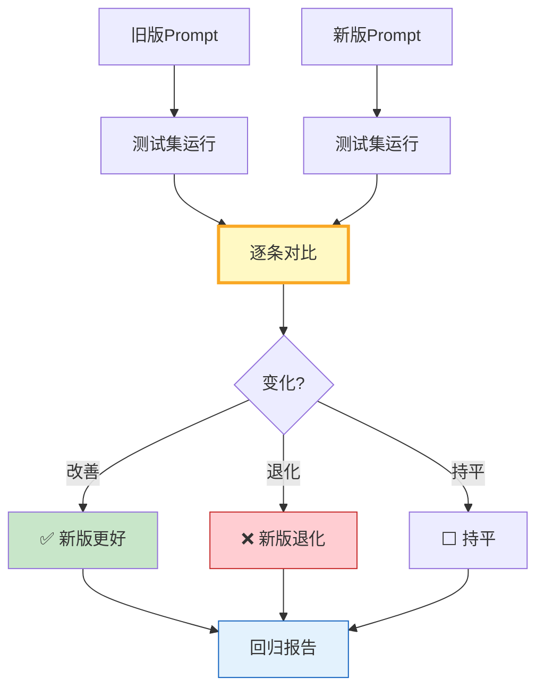

# Prompt 回归测试图解

> 旧版和新版Prompt在同一测试集上跑→逐条对比→改善/退化/持平。

---

---

## 测试集设计

| 类别 | 说明 | 优先级 |
|------|------|--------|
| 核心场景 | 最常见用例 | ★★★ |
| 边界用例 | 空输入/超长 | ★★★ |
| 退化陷阱 | 易退化用例 | ★★★ |
| 格式验证 | 输出格式 | ★★☆ |
| 安全用例 | 越狱防护 | ★★☆ |

---

## 检查清单

| 检查项 | 状态 |
|--------|------|
| 有版本对比 | ☐ |
| 有退化检测 | ☐ |
| 有回归报告 | ☐ |
| 支持CI集成 | ☐ |
