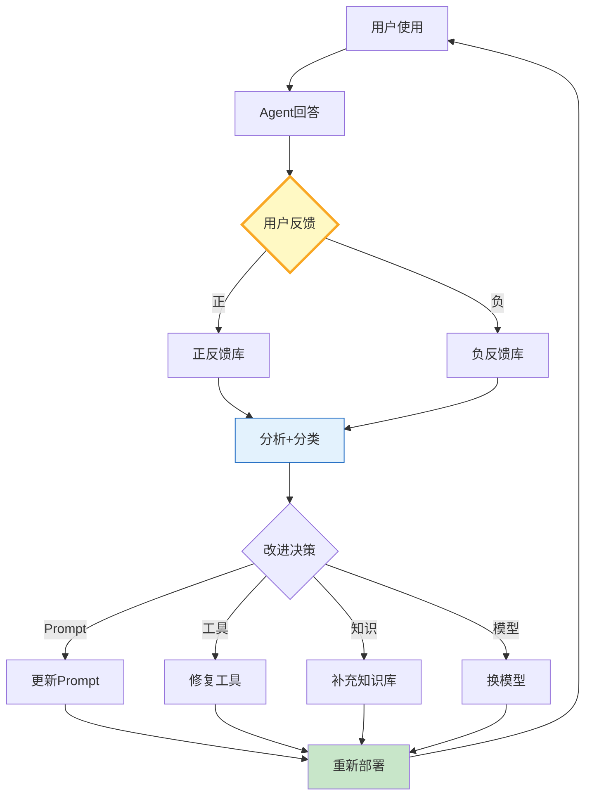

# 用户反馈闭环图解

> 收集→分析→改进→重新部署→再收集——持续改进循环。

---

---

## 反馈方式对比

| 方式 | 收集率 | 质量 | 适用 |
|------|--------|------|------|
| 👍/👎 | 高 | 低 | 通用 |
| 1-5星 | 中 | 中 | 通用 |
| 文字 | 低 | 高 | 深度 |
| 用户修正 | 低 | 极高 | 准确性 |
| 隐式信号 | 极高 | 中 | 大规模 |

---

## 检查清单

| 检查项 | 状态 |
|--------|------|
| 有反馈收集 | ☐ |
| 有反馈分析 | ☐ |
| 有改进动作 | ☐ |
| 有闭环循环 | ☐ |
