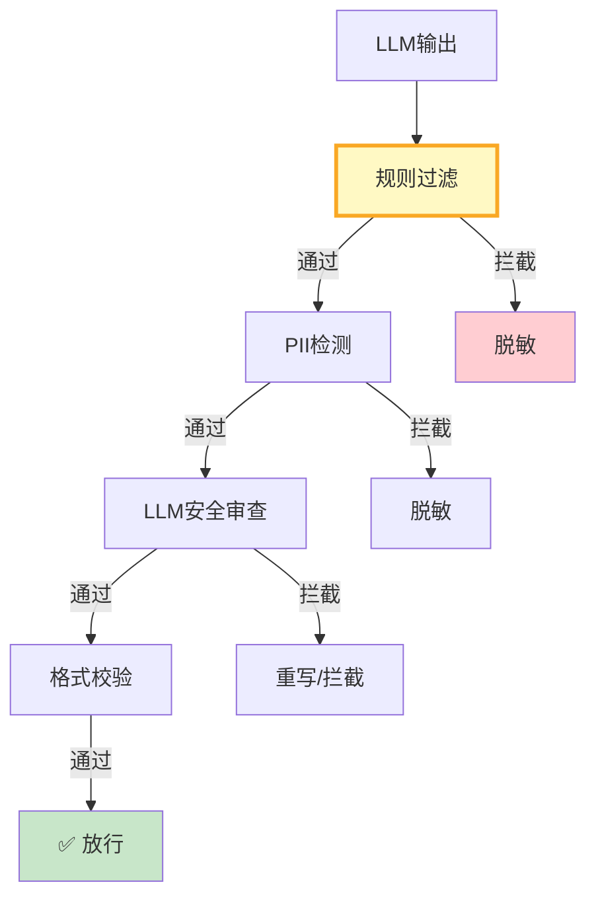

# 输出护栏与内容过滤图解

> 规则→PII→LLM安全审查三级管线，拦截后脱敏/重写而非丢弃。

---

---

## 过滤策略对比

| 策略 | 速度 | 准确率 | 适用 |
|------|------|--------|------|
| 规则过滤 | 极快 | 中 | 关键词 |
| PII检测 | 快 | 高 | 隐私 |
| LLM审查 | 慢 | 高 | 有害内容 |
| 混合管线 | 中 | 高 | 生产 |

---

## 检查清单

| 检查项 | 状态 |
|--------|------|
| 有规则过滤 | ☐ |
| 有PII检测 | ☐ |
| 有LLM安全审查 | ☐ |
| 有拦截日志 | ☐ |
