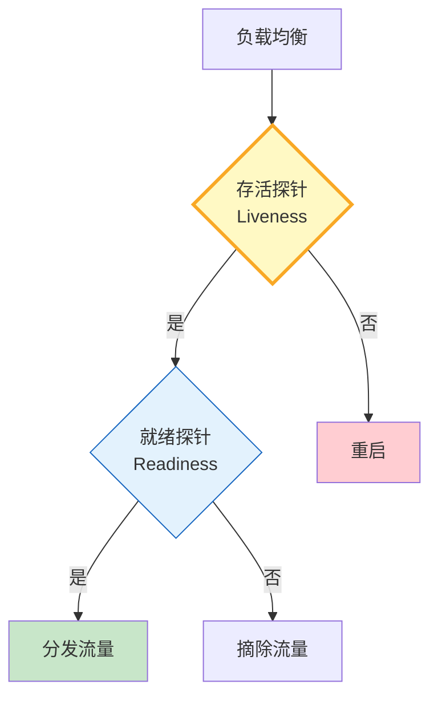

# 健康探针图解

> 存活探针回答"活着吗"，就绪探针回答"能干活吗"——双探针分离重启与摘流。

---

---

## 探针配置

| 类型 | 间隔 | 超时 | 失败动作 |
|------|------|------|----------|
| Liveness | 30s | 5s | 重启 |
| Readiness | 10s | 3s | 摘流 |
| Startup | 5s | 30s | 阻流 |

---

## 检查清单

| 检查项 | 状态 |
|--------|------|
| 有存活探针 | ☐ |
| 有就绪探针 | ☐ |
| 有降级状态 | ☐ |
| 有超时控制 | ☐ |
