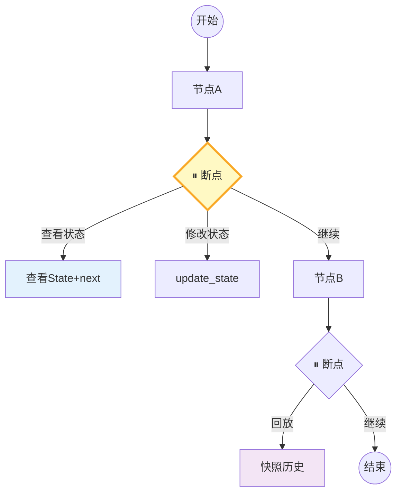

# 断点调试与步骤回放图解

> 节点前暂停→查看状态→修改后继续→回放历史——像调试器一样调试LangGraph。

---

---

## 调试方式

| 方式 | 实现 | 适用 |
|------|------|------|
| interrupt_before | 编译时指定 | 固定断点 |
| interrupt_after | 节点后暂停 | 查输出 |
| 动态interrupt | 运行时判断 | 条件断点 |
| 快照回放 | get_state_history | 事后分析 |

---

## 检查清单

| 检查项 | 状态 |
|--------|------|
| 有断点设置 | ☐ |
| 有单步执行 | ☐ |
| 有状态修改 | ☐ |
| 有快照回放 | ☐ |
