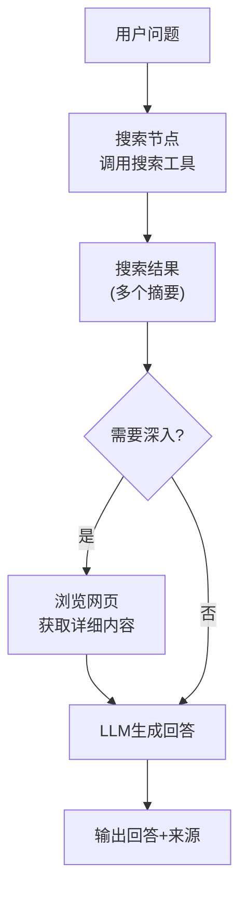
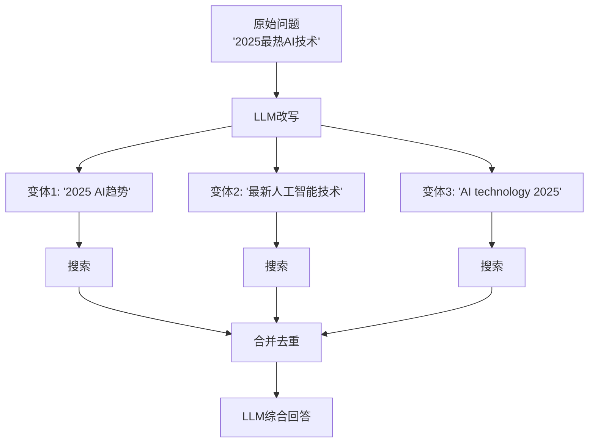
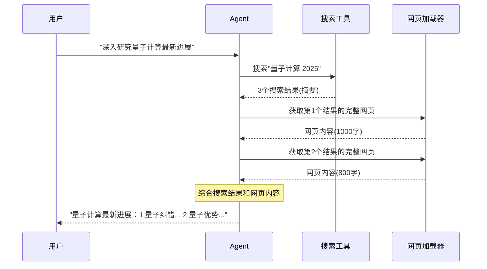
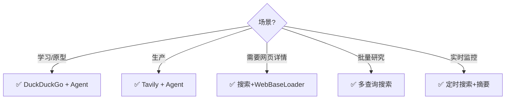

# Web 搜索 Agent 架构图解

> 用图解理解 Web 搜索 Agent 的工作流程和工具选择。

---

## 一、搜索 Agent 工作流程



## 二、搜索工具对比

```mermaid
graph TB
    subgraph 工具选择 {"搜索工具选择"}
        DDG["DuckDuckGo<br/>✅ 免费 ✅ 无需Key<br/>❌ 质量一般<br/>适合: 学习/原型"]
        TAVILY["Tavily<br/>✅ AI优化 ✅ 质量高<br/>❌ 有费用<br/>适合: 生产"]
        BRAVE["BraveSearch<br/>✅ 隐私好<br/>❌ 有费用<br/>适合: 隐私场景"]
        SERP["SerpAPI<br/>✅ Google结果<br/>❌ 付费<br/>适合: 精确搜索"]
    end

    style DDG fill:'#C8E6C9'
    style TAVILY fill:'#E3F2FD'
```

## 三、多查询搜索



## 四、搜索+浏览组合



## 五、选型决策


