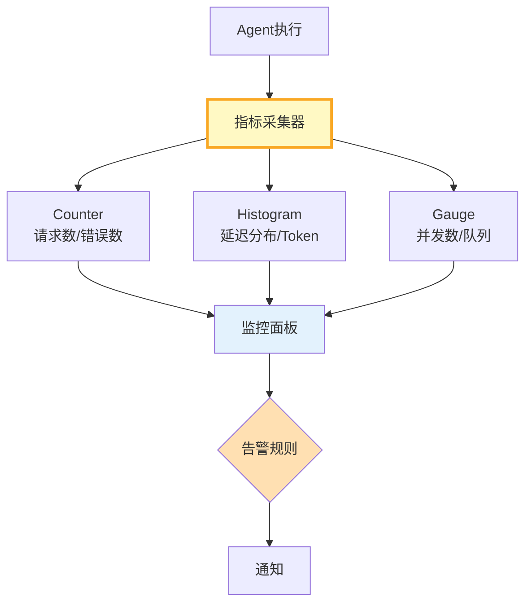

# 指标采集与监控面板图解

> Counter+Histogram+Gauge三种指标→采集器→面板→告警规则。

---

---

## 核心指标

| 指标 | 类型 | 告警阈值 |
|------|------|----------|
| 请求数 | Counter | - |
| 错误数 | Counter | 增量>0 |
| 延迟 | Histogram | p95>5s |
| Token | Histogram | 日>预算 |
| 并发 | Gauge | >max×0.8 |

---

## 检查清单

| 检查项 | 状态 |
|--------|------|
| 有Counter | ☐ |
| 有Histogram | ☐ |
| 有Gauge | ☐ |
| 有监控面板 | ☐ |
