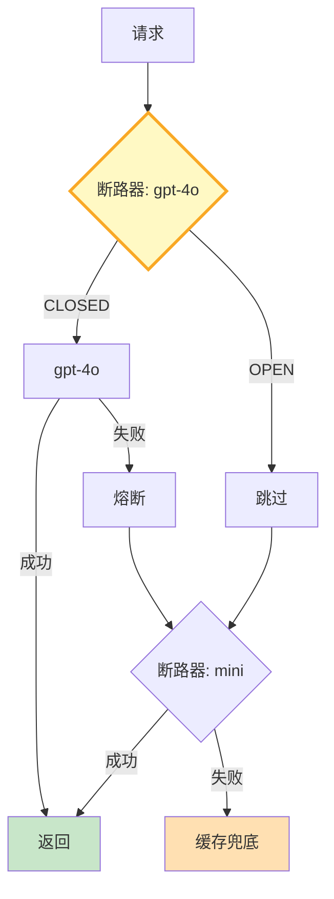

# 降级链与断路器图解

> gpt-4o熔断→gpt-4o-mini→gpt-3.5→缓存兜底。断路器三态：CLOSED/OPEN/HALF_OPEN。

---

---

## 断路器三态

| 状态 | 行为 | 转换条件 |
|------|------|----------|
| CLOSED | 正常放行 | 失败N次→OPEN |
| OPEN | 熔断跳过 | 超时→HALF_OPEN |
| HALF_OPEN | 试探1个 | 成功→CLOSED, 失败→OPEN |

---

## 检查清单

| 检查项 | 状态 |
|--------|------|
| 有断路器 | ☐ |
| 有降级链 | ☐ |
| 有缓存兜底 | ☐ |
| 有半开恢复 | ☐ |
