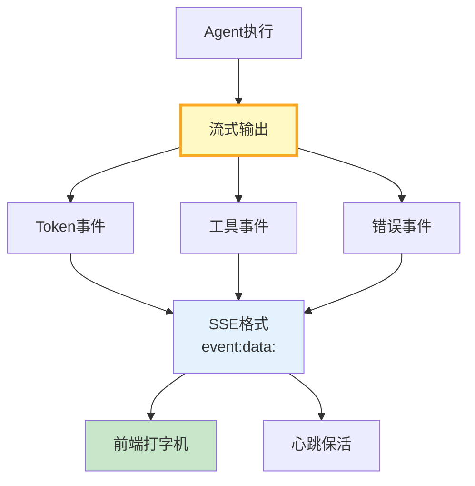

# 流式输出与SSE图解

> 逐Token推送→SSE格式→前端打字机渲染。首Token延迟从8s降到200ms。

---

---

## 流式 vs 非流式

| 维度 | 非流式 | 流式 |
|------|--------|------|
| 首Token | 8s | 200ms |
| 用户感知 | 焦虑 | 即时 |
| 超时风险 | 高 | 低 |
| 可中断 | 否 | 是 |

---

## 检查清单

| 检查项 | 状态 |
|--------|------|
| 有SSE管理器 | ☐ |
| 有Token推送 | ☐ |
| 有心跳保活 | ☐ |
| 有完成信号 | ☐ |
