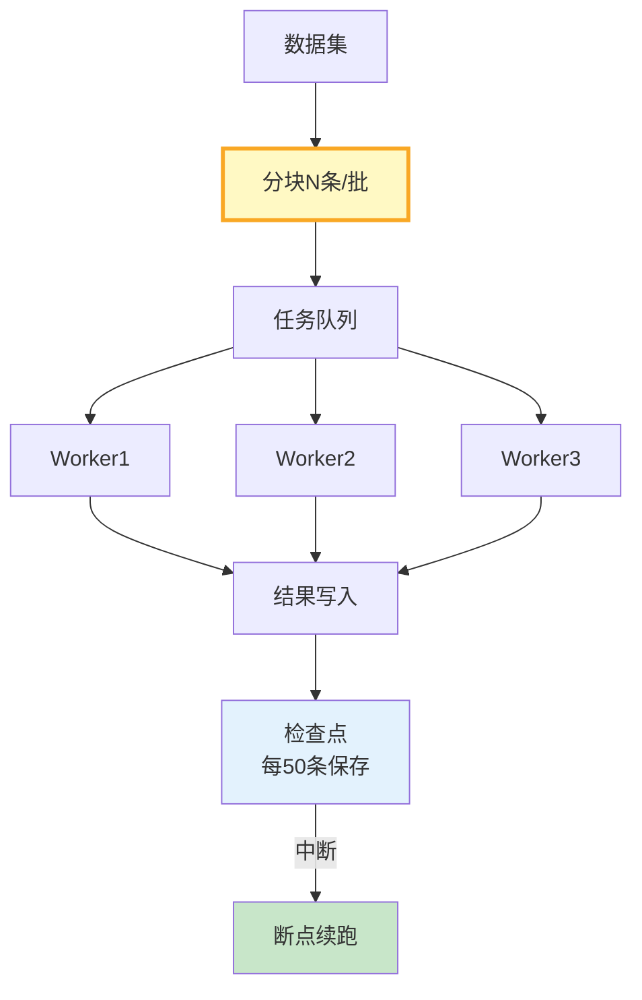

# 离线批量推理管线图解

> 分块→并发Worker→检查点→断点续跑。中断后不重头。

---

---

## 并发配置

| 场景 | batch | 并发 | 重试 |
|------|-------|------|------|
| 轻量 | 20 | 5 | 2 |
| 重推理 | 10 | 3 | 2 |
| 限流 | 5 | 2 | 3 |
| 不限 | 50 | 10 | 1 |

---

## 检查清单

| 检查项 | 状态 |
|--------|------|
| 有分块 | ☐ |
| 有并发控制 | ☐ |
| 有检查点 | ☐ |
| 有断点续跑 | ☐ |
