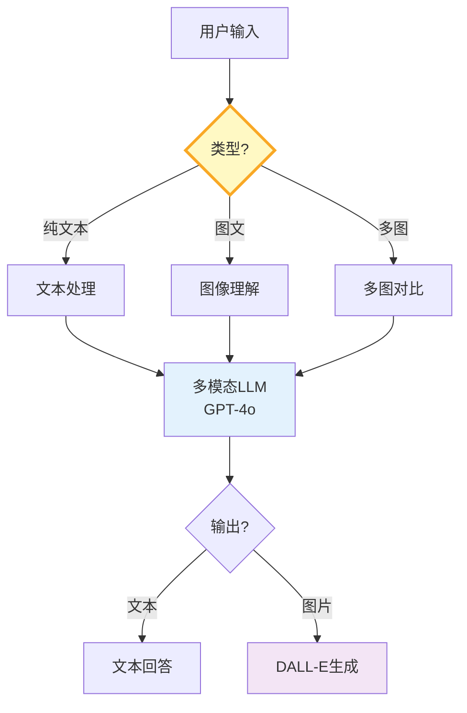

# 多模态输入输出图解

> 图片+文本→多模态LLM→文本/图片输出。OCR、图问答、多图对比、文生图。

---

---

## 多模态场景

| 场景 | 输入 | 输出 | 难度 |
|------|------|------|------|
| 图问答 | 图+文本 | 文本 | 中 |
| OCR | 图 | 文本 | 中 |
| 多图对比 | 多图 | 文本 | 高 |
| 文生图 | 文本 | 图 | 中 |

---

## 检查清单

| 检查项 | 状态 |
|--------|------|
| 有图片问答 | ☐ |
| 有OCR | ☐ |
| 有图像生成 | ☐ |
| 有降级策略 | ☐ |
