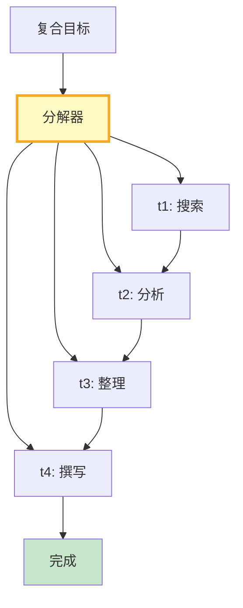

# 目标分解与任务规划图解

> 复合目标→分解为子任务→构建依赖图→按拓扑顺序执行→支持动态重规划。

---

---

## 分解策略

| 策略 | 适用 | 特点 |
|------|------|------|
| LLM分解 | 通用 | 灵活 |
| 模板分解 | 固定流程 | 快速 |
| 递归分解 | 复杂 | 精细 |
| 混合 | 生产 | 兼顾 |

---

## 检查清单

| 检查项 | 状态 |
|--------|------|
| 有目标分解器 | ☐ |
| 有依赖图 | ☐ |
| 有拓扑排序 | ☐ |
| 有动态重规划 | ☐ |
