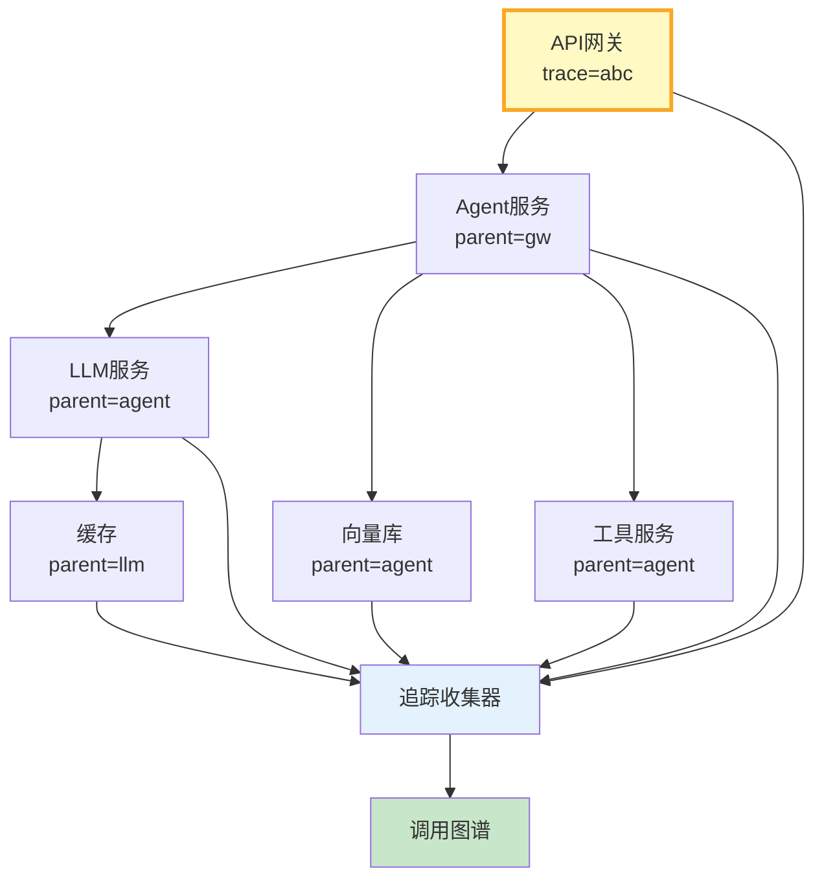

# 分布式追踪与调用图谱图解

> trace_id贯穿所有服务，parent_span_id构建调用树，一图看全链路。

---

---

## 追踪字段

| 字段 | 说明 | 示例 |
|------|------|------|
| trace_id | 全局ID | abc123 |
| span_id | 本Span | def456 |
| parent_id | 父Span | abc123 |
| service | 服务名 | llm-service |
| duration_ms | 耗时 | 350 |

---

## 检查清单

| 检查项 | 状态 |
|--------|------|
| 有trace_id透传 | ☐ |
| 有调用树 | ☐ |
| 有调用图谱 | ☐ |
| 有慢路径检测 | ☐ |
