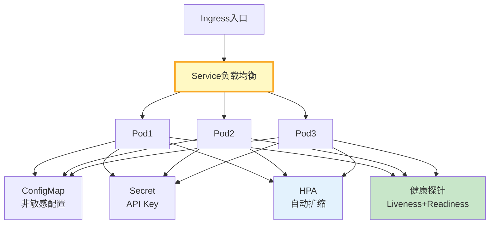

# 云原生部署与容器化图解

> Docker容器→K8s编排→ConfigMap/Secret配置→HPA扩缩→健康探针。

---

---

## 部署检查

| 检查项 | 说明 |
|--------|------|
| Dockerfile | 最小镜像 |
| 健康探针 | Liveness+Readiness |
| 配置外部化 | ConfigMap |
| 密钥管理 | Secret |
| 资源限制 | CPU+Memory |
| HPA扩缩 | CPU>70% |

---

## 检查清单

| 检查项 | 状态 |
|--------|------|
| 有Dockerfile | ☐ |
| 有K8s部署 | ☐ |
| 有健康探针 | ☐ |
| 有自动扩缩 | ☐ |
