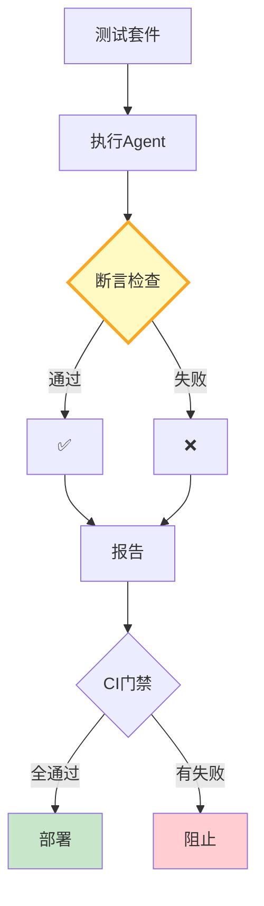

# 端到端测试框架图解

> 测试套件→Mock环境→执行Agent→断言检查→CI门禁。

---

---

## 断言类型

| 类型 | 精确度 | 适用 |
|------|--------|------|
| 关键词包含 | 中 | 事实问答 |
| 精确匹配 | 高 | 固定格式 |
| 工具调用检查 | 高 | 工具验证 |
| 响应时间 | 高 | 性能 |
| 语义匹配 | 高 | 复杂回答 |

---

## 检查清单

| 检查项 | 状态 |
|--------|------|
| 有测试管理 | ☐ |
| 有多类断言 | ☐ |
| 有CI门禁 | ☐ |
| 有失败详情 | ☐ |
