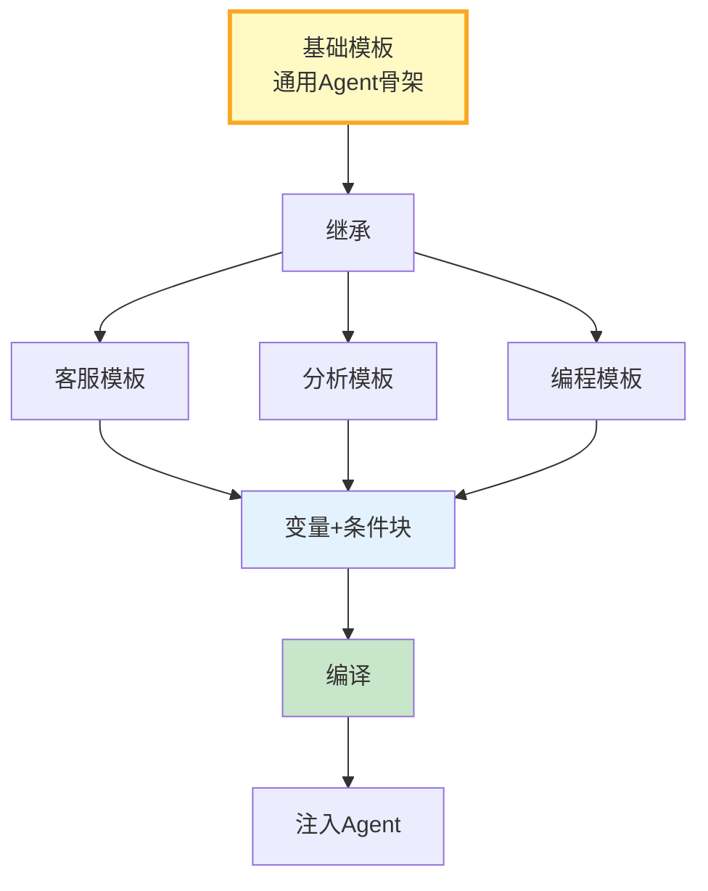

# 提示词模板库图解

> 基础模板→继承→变量插值→条件块→编译为最终Prompt。

---

---

## 复用模式

| 模式 | 优点 | 适用 |
|------|------|------|
| 继承 | 复用骨架 | 同类场景 |
| 组合 | 灵活 | 复杂场景 |
| 参数化 | 简单 | 通用 |
| 条件块 | 动态 | 可配置 |
| 预设场景 | 开箱即用 | 常见 |

---

## 检查清单

| 检查项 | 状态 |
|--------|------|
| 有模板库 | ☐ |
| 有继承 | ☐ |
| 有变量插值 | ☐ |
| 有条件块 | ☐ |
