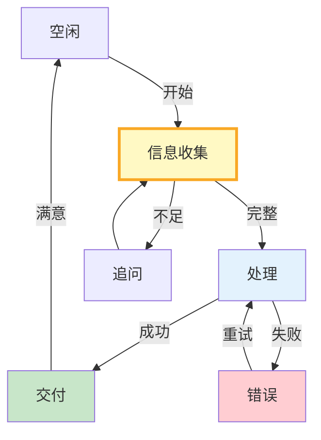

# 状态机设计模式图解

> idle→gather→process→deliver→idle，状态转换表驱动流程。

---

---

## 常见状态机模式

| 模式 | 适用 |
|------|------|
| 问答型 | 客服FAQ |
| 审批型 | 流程审批 |
| 订单型 | 电商 |
| 修复型 | 运维 |
| 迭代型 | 内容创作 |

---

## 检查清单

| 检查项 | 状态 |
|--------|------|
| 有状态定义 | ☐ |
| 有转换路由 | ☐ |
| 有错误重试 | ☐ |
| 有转换表 | ☐ |
