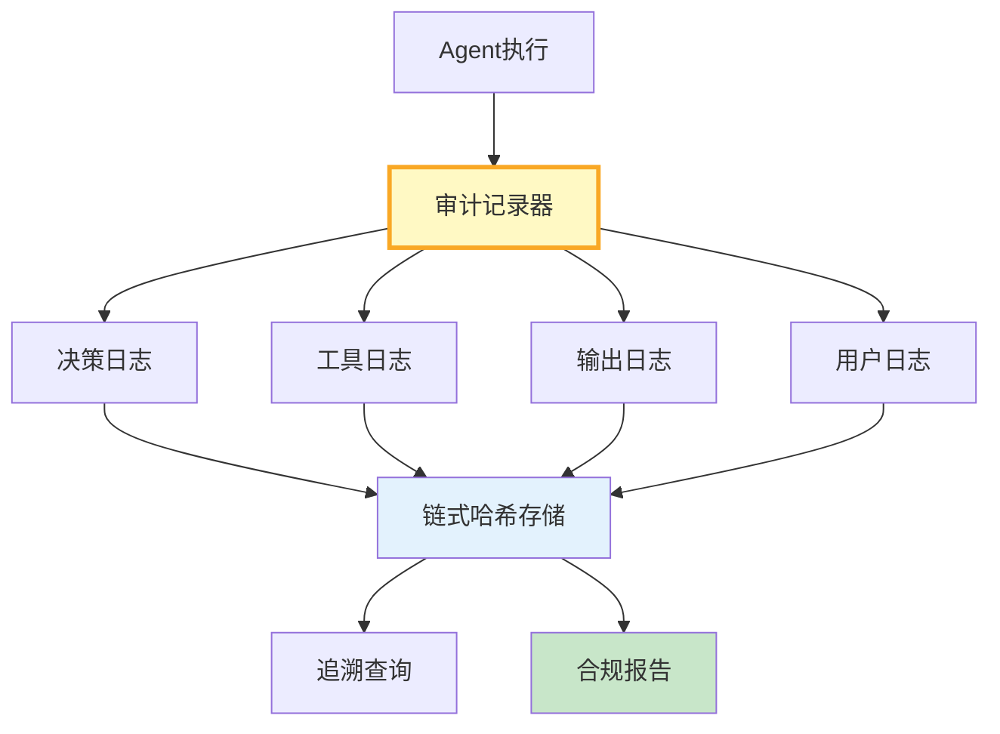

# 审计日志与合规追溯图解

> 决策日志+工具日志+输出日志+用户日志→链式哈希不可篡改→追溯查询。

---

---

## 审计字段

| 字段 | 必填 | 示例 |
|------|------|------|
| entry_id | 是 | audit-001 |
| action | 是 | tool_call |
| user_id | 是 | user123 |
| input_summary | 否 | 已脱敏 |
| hash | 是 | a1b2c3 |

---

## 检查清单

| 检查项 | 状态 |
|--------|------|
| 有审计记录 | ☐ |
| 有PII脱敏 | ☐ |
| 有链式哈希 | ☐ |
| 有合规报告 | ☐ |
