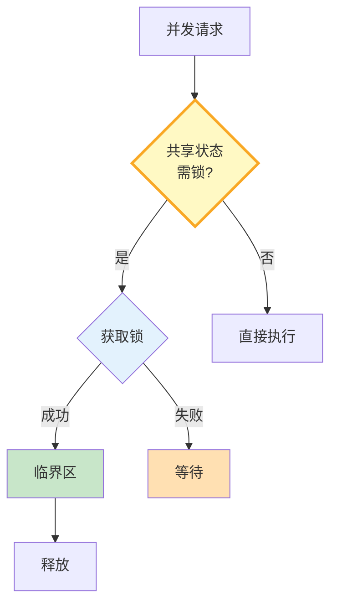

# 并发安全与锁机制图解

> 悲观锁先锁后操作，乐观锁先操作后检查，分布式锁跨进程。

---

---

## 锁类型对比

| 类型 | 原理 | 适用 |
|------|------|------|
| 悲观锁 | 先锁后操作 | 写频繁 |
| 乐观锁 | 先操作后检查 | 读多写少 |
| 分布式锁 | 跨进程 | 多实例 |

---

## 检查清单

| 检查项 | 状态 |
|--------|------|
| 有悲观锁 | ☐ |
| 有乐观锁 | ☐ |
| 有TTL防死锁 | ☐ |
| 有锁统计 | ☐ |
