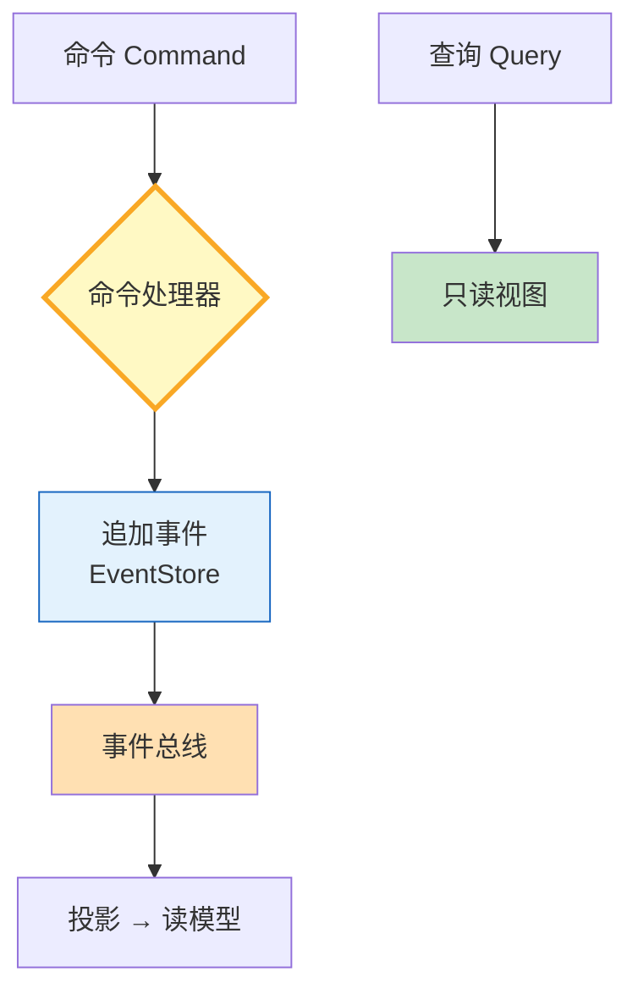

# 事件溯源与 CQRS 图解

> 写入只追加事件、读取走预投影视图，读写模型彻底分离。

---

---

## 读写分离对比

| 模式 | 写入侧 | 读取侧 | 特点 |
|------|--------|--------|------|
| 传统CRUD | 直接覆盖 | 直接读 | 简单但丢历史 |
| 事件溯源 | 追加事件 | 投影视图 | 可重放可审计 |
| CQRS | 命令处理 | 读模型 | 读写独立优化 |

---

## 检查清单

| 检查项 | 状态 |
|--------|------|
| 有不可变事件 | ☐ |
| 有EventStore | ☐ |
| 有命令处理器 | ☐ |
| 有投影读模型 | ☐ |
| 有事件重放 | ☐ |
